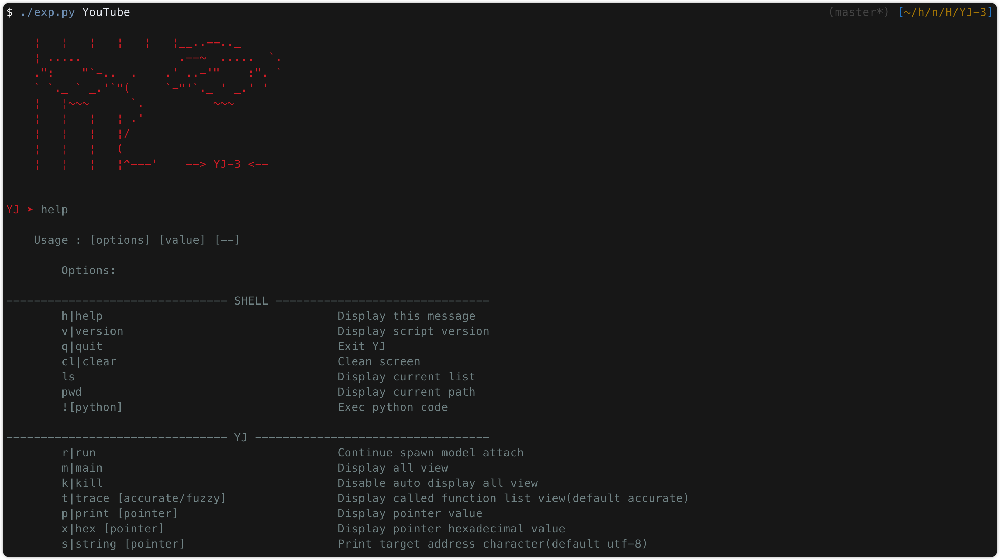
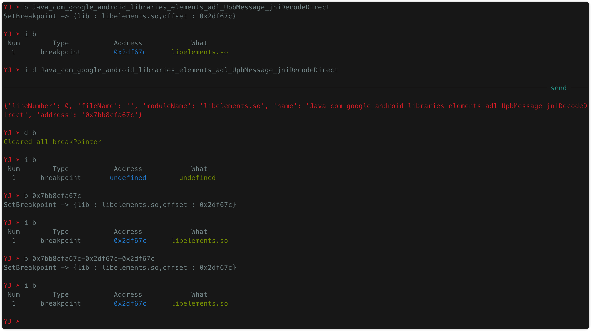
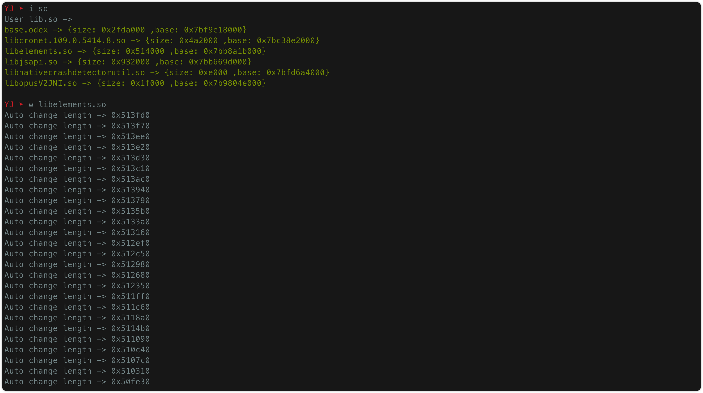

## Background

`YJ` is a Frida-based scripting tool, just like using `GDB` tool on `GUN-Linux`, it can easily show you the memory data you want to snoop on (even if it is non-debug in App)--------------------------------------------it is inspired by `GEF`

It can help you make better use of Frida in so binaries

## Environment

Because it is based on the upper development of frida, you only need to install `frida`

## Installation

```sh
~ » git clone https://github.com/yang-datong/YJ.git
~ » cd YJ && chmod +x exp.py
```

## Use

├── README.md
├── common
│   ├── cmd.py
│   ├── get_target_binary.sh
│   ├── layout.js
│   ├── layout.py
│   ├── load_frida.sh
│   └── utility.js
├── exp.py
├── model
│   └── main.js
└── style
    └── config.json

`exp.py` -> It is a layout debugger and, of course, a script container for Frida

`main.js` -> It is the core file that you use Frida to Hook the target program. You should do Hook here

`utility.js` -> It is a tool library that I use to encapsulate API, and you can extend it here

`get_target_binary.sh` -> It is used to get the disassembly code of the object file

`config.json` -> It is the style configuration information for the tool

`layout.py` -> Layout architecture for modules

`.YJ-lib.so` -> It is the target lib under the runtime dump（Will only be generated after it is run）

`.YJ-lib.so.asm` -> Reverse the assembled cache files for faster access later（Will only be generated after it is run）

`load_frida.sh` -> Quickly start the `frida-service` in the phone

`cmd.py` -> Built-in interaction `shell`

`layout.js` -> Command tools kernel layer

## Screenshot








## Update Log

After upgrading v2.0, ~~you need to install Linux- > objdump under Mac, which currently performs well under Mac and Linux(Windows is not tested,I think it's the same )~~ --- (Now no need to install)

After upgrading v3.0, a command interaction mode is provided to change the snoop target at will. Now it looks more like a combination of `GUN-GDB + GEF`, now has more complete documentation
